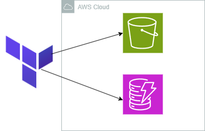

<p align="center">
  
  
## ☁️ MultiCloud, DevOps & AI Challenge - Day 1 - Automating AWS provisioning using Terraform  ☁️

This is part of the first project of the challenge/bootcamp! 

In this project we will be setting up our whole set of project for this challenge utilizing terraform to create a S3 bucket and create a DynamoDB table which will be the basis and start of our project.


<h2>Environments and Technologies Used</h2>

  - Terraform
  - Amazon Web Services
  - Github Codespaces
  - S3
  - DynamoDB
  


  
<h2>Features</h2>  


<h2>Step by Step Instructions</h2>

<h2></h2>


***1. Repo configuration***


NOTE: Keep in mind this is for a Linux environment, check the AWS documentation to install it in your supported OS.


   curl "https://awscli.amazonaws.com/awscli-exe-linux-x86_64.zip" -o "awscliv2.zip"
unzip awscliv2.zip
sudo ./aws/install


We then do `AWS configure` and enter our access and secret key along with the region. Output format set to JSON. With this command we will double check that our credentials are put in place for CLI:

```
aws sts get-caller-identity
```

We will then install terraform CLI:

```
sudo wget -O - https://apt.releases.hashicorp.com/gpg | sudo gpg --dearmor -o /usr/share/keyrings/hashicorp-archive-keyring.gpg
echo "deb [arch=$(dpkg --print-architecture) signed-by=/usr/share/keyrings/hashicorp-archive-keyring.gpg] https://apt.releases.hashicorp.com $(lsb_release -cs) main" | sudo tee /etc/apt/sources.list.d/hashicorp.list
sudo apt update && sudo apt install terraform
```


***3. ***


***4. ***


***6. ***


***7. ***


***8. ***


<h2>Conclusion</h2>

In this project, I learned how to 

